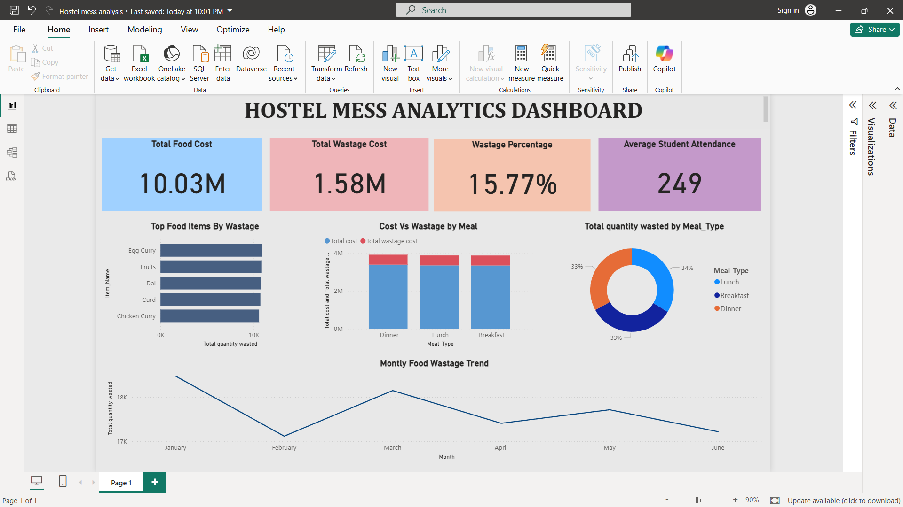

# 🍽️ Hostel Mess Analytics Dashboard (Power BI)

## 📊 Overview

This project analyzes hostel mess data to understand food expenses, wastage, and student attendance.
The goal is to identify inefficiencies and reduce food wastage.

---

## 🎯 Key Metrics

* **Total Food Cost:** 10.03M
* **Total Wastage Cost:** 1.58M
* **Wastage Percentage:** 15.77%
* **Average Student Attendance:** 249

---

## 📷 Dashboard Preview

---

## 📈 Insights from the Dashboard

### 🔹 Wastage Analysis

* Identifies food items with the highest wastage
* Helps in reducing unnecessary food preparation

### 🔹 Cost vs Wastage by Meal

* Compares cost and wastage across Breakfast, Lunch, and Dinner
* Highlights inefficient meal periods

### 🔹 Meal-wise Distribution

* Shows how wastage is spread across different meals

### 🔹 Monthly Trends

* Tracks how wastage changes over time
* Helps in planning better food quantity

---

## 💡 Key Takeaways

* Around **16% of food cost is wasted**
* Some items consistently generate high waste
* Data can help optimize mess operations and reduce cost

---

## 🛠 Tools Used

* Microsoft Power BI
* Data Modeling
* DAX

---

## 📁 Files in This Repository

* Hostel mess analysis.pbix
* Hostel_Mess_Food_Wastage_6_Months.xlsx
* hostel mess analysis dashboard.png

---

## 🚀 How to Use

1. Download the `.pbix` file
2. Open it in Power BI Desktop
3. Explore the dashboard
